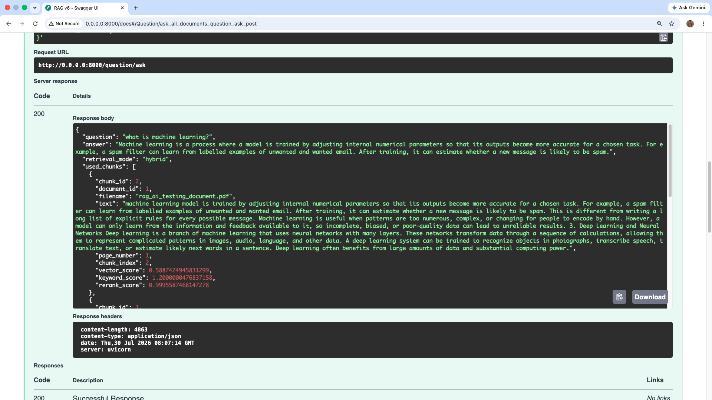
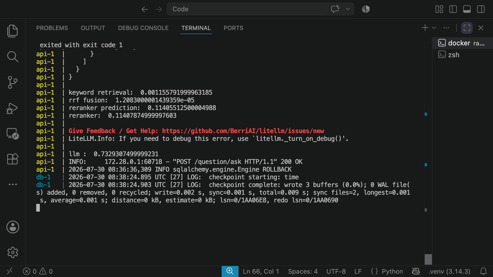
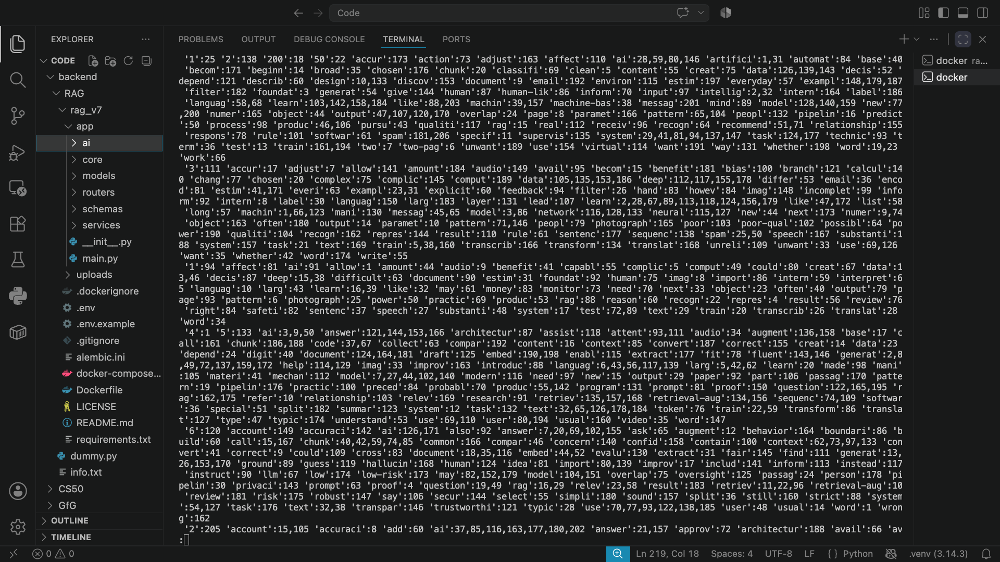
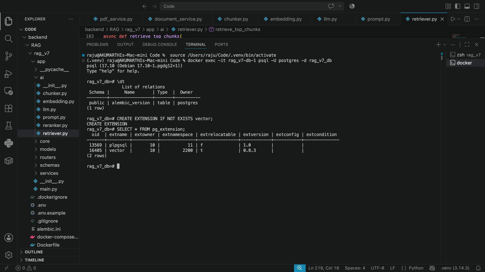

# Hybrid RAG From Scratch — Version 7

A production-style **Retrieval-Augmented Generation backend** built from first principles with FastAPI, PostgreSQL, pgvector, hybrid search, Reciprocal Rank Fusion, CrossEncoder reranking, metadata filtering, and Docker.

This repository is part of an incremental RAG learning series. Each version preserves the existing architecture and introduces one meaningful improvement so the effect of every change can be understood, measured, and debugged.

---

## Project Overview

Modern RAG frameworks can make systems quick to assemble, but they may also hide the decisions that determine retrieval quality.

This project implements the core pipeline directly so every stage remains visible:

- PDF extraction
- sentence-aware chunking
- embedding generation
- vector storage and search
- PostgreSQL full-text search
- hybrid retrieval
- rank fusion
- CrossEncoder reranking
- metadata filtering
- prompt construction
- LLM generation

The goal is not to avoid frameworks forever. The goal is to understand the underlying system well enough to use frameworks deliberately rather than depend on hidden behaviour.

---

## Version Progression

| Version | Main Improvement |
|---|---|
| V4 | Modular RAG pipeline built from scratch |
| V5 | Hybrid retrieval with vector search, PostgreSQL full-text search, and RRF |
| V6 | CrossEncoder reranking for stronger final relevance |
| **V7** | **Metadata filtering, centralised configuration, and reranker preloading** |

The architecture is intentionally reused between versions. This makes it easier to isolate the effect of each improvement and reason about failures across the complete pipeline.

---

## Architecture

### Document Ingestion

```text
PDF Upload + Category
        ↓
Plain-text Extraction
        ↓
Sentence-aware Chunking with Overlap
        ↓
Embedding Generation
        ↓
Store Document Metadata
        +
Store Chunks and Embeddings
        +
Generate PostgreSQL Search Vectors
```

### Question Answering

```text
Question + Optional Category Filter
                  ↓
          Generate Query Embedding
                  ↓
       ┌──────────┴──────────┐
       ↓                     ↓
Vector Retrieval      Keyword Retrieval
   pgvector              tsvector
       │                     │
       └──────────┬──────────┘
                  ↓
     Reciprocal Rank Fusion
                  ↓
       CrossEncoder Reranking
                  ↓
            Best Chunks
                  ↓
          Prompt Construction
                  ↓
                LLM
                  ↓
     Grounded Answer + Sources
```

Metadata filtering is applied inside both retrieval queries before ranking and limiting. This prevents unrelated documents from entering the candidate set.

---

## Core Features

| Feature | Status |
|---|---:|
| PDF upload with category metadata | ✅ |
| Plain-text PDF extraction | ✅ |
| Sentence-aware chunking with overlap | ✅ |
| Vector embedding generation | ✅ |
| Semantic retrieval with pgvector | ✅ |
| PostgreSQL full-text search with `tsvector` | ✅ |
| Vector, keyword, and hybrid retrieval modes | ✅ |
| Reciprocal Rank Fusion | ✅ |
| CrossEncoder reranking | ✅ |
| Category-based metadata filtering | ✅ |
| Document-specific questioning | ✅ |
| Grounded answers with source metadata | ✅ |
| Async FastAPI and SQLAlchemy flow | ✅ |
| Alembic migrations | ✅ |
| Pydantic Settings configuration | ✅ |
| Dockerised local development | ✅ |
| Reranker preloading during application startup | ✅ |

---

## Why Hybrid Retrieval?

Vector search and keyword search solve different retrieval problems.

**Vector search** is useful for semantic similarity. It can retrieve relevant chunks even when the wording of the question differs from the document.

**Keyword search** is useful for exact terminology, names, and phrases that semantic retrieval may miss.

Version 7 combines both systems:

```text
Vector Ranking
      +
Keyword Ranking
      ↓
Reciprocal Rank Fusion
      ↓
CrossEncoder Reranking
```

This produces a stronger candidate set than relying on either retrieval method alone.

---

## Why CrossEncoder Reranking?

Embedding similarity is efficient for candidate retrieval, but the chunk with the highest vector score is not always the best answer.

A CrossEncoder evaluates the complete `(question, chunk)` pair and produces a stronger relevance score. It is used only after retrieval, so the system keeps vector and keyword search fast while improving the final ordering of evidence.

---

## Performance Optimisation

Each major stage of the retrieval pipeline was timed independently rather than optimised by guesswork.

Initial testing showed that the first hybrid request took approximately **29 seconds** because the CrossEncoder model was being loaded during the request.

The reranker was moved to the FastAPI startup lifecycle and cached for reuse.

Typical warm-request timings after preloading:

```text
Keyword Retrieval       ≈ 0.003 s
RRF Fusion              ≈ 0.00001 s
CrossEncoder Reranking  ≈ 0.12 s
```

This moved model-loading cost to application startup and reduced request-time reranking latency dramatically.

The debugging process followed this pattern:

```text
Observe Slow Request
        ↓
Time Every Stage
        ↓
Identify the Bottleneck
        ↓
Preload the Reranker
        ↓
Measure Again
        ↓
Confirm the Improvement
```

---

## Technology Stack

- **Python**
- **FastAPI**
- **PostgreSQL**
- **pgvector**
- **SQLAlchemy 2.0**
- **Alembic**
- **Pydantic Settings**
- **Sentence Transformers**
- **CrossEncoder**
- **LiteLLM**
- **Gemini**
- **Docker**

---

## Project Structure

The exact directory names may vary slightly, but the codebase follows a modular backend structure similar to this:

```text
app/
├── ai/
│   ├── embeddings.py
│   ├── llm.py
│   ├── prompts.py
│   ├── reranker.py
│   └── retriever.py
├── core/
│   └── config.py
├── database/
│   └── database.py
├── models/
│   ├── document.py
│   └── document_chunk.py
├── routers/
│   ├── documents.py
│   └── questions.py
├── schemas/
│   ├── documents.py
│   └── questions.py
├── services/
│   ├── document_service.py
│   └── pdf_service.py
├── main.py
alembic/
docker-compose.yml
Dockerfile
requirements.txt
.env.example
README.md
LICENSE
```

---

## Configuration

Configuration values are centralised and validated through Pydantic Settings.

Example `.env`:

```env
DATABASE_URL=postgresql+asyncpg://postgres:postgres@db:5432/rag_db

EMBEDDING_MODEL=sentence-transformers/all-MiniLM-L6-v2
EMBEDDING_DIMENSION=384

RERANKER_MODEL_NAME=cross-encoder/ms-marco-MiniLM-L6-v2
RERANK_CANDIDATE_K=10

GEMINI_API_KEY=your_api_key
GEMINI_MODEL=gemini/gemini-2.0-flash
```

Never commit `.env` files or real API keys.

A safe `.gitignore` should include at least:

```gitignore
.env
.venv/
__pycache__/
*.pyc
.pytest_cache/
.idea/
.vscode/
.DS_Store
```

---

## Running the Project

### 1. Clone the repository

```bash
git clone https://github.com/<your-username>/<your-repository>.git
cd <your-repository>
```

### 2. Create the environment file

Create a `.env` file using the configuration example above.

### 3. Build and start the services

```bash
docker compose up --build
```

### 4. Run database migrations

```bash
docker compose exec api alembic upgrade head
```

### 5. Open Swagger UI

```text
http://localhost:8000/docs
```

---

## Example Question Request

```json
{
  "question": "What is machine learning?",
  "category": "artificial-intelligence",
  "top_k": 3,
  "retrieval_mode": "hybrid"
}
```

When `category` is omitted, the system can search across all uploaded documents.

---

## Screenshots

### Hybrid Question Answering



### Retrieval Timings



### Stored Search Vectors



### pgvector Extension



---

## Current Scope

This version intentionally supports **plain-text PDFs only**.

Scanned documents, OCR, tables, images, and layout-aware extraction are outside the current scope because the purpose of Version 7 is to master the central retrieval and generation pipeline first.

---

## Engineering Decisions

- Retrieval and generation are separated into distinct modules.
- Metadata filtering happens inside SQL queries rather than after retrieval in Python.
- Vector and keyword retrieval remain independent before rank fusion.
- CrossEncoder reranking is applied only to a limited candidate set.
- The reranker is preloaded during application startup.
- Configuration is centralised through typed settings.
- Async database access is used throughout the backend.
- Docker Compose provides reproducible local infrastructure.
- Each version adds one major concept while preserving the architecture.

---

## What This Project Demonstrates

- Building a RAG pipeline without orchestration frameworks
- Designing modular AI backend architecture
- Using PostgreSQL as both a relational database and retrieval engine
- Combining semantic and lexical retrieval
- Implementing Reciprocal Rank Fusion
- Applying CrossEncoder reranking
- Filtering retrieval through metadata
- Profiling latency and locating real bottlenecks
- Improving cold-start behaviour through model preloading
- Debugging retrieval and generation layer by layer

---

## Roadmap

The next stages will continue improving retrieval and context quality before moving toward agentic systems.

```text
Parent-child Retrieval
        ↓
Context Compression
        ↓
Multi-query and Multi-vector Retrieval
        ↓
Retrieval Evaluation and Optimisation
        ↓
Conversation Memory
        ↓
Structured Outputs and Tool Calling
        ↓
Planning and Agent Workflows
        ↓
Human-in-the-loop Execution
        ↓
Tracing, Cost, Evaluation, and Observability
```

---

## Project Philosophy

```text
Understand the Purpose
        ↓
Design the Architecture
        ↓
Reason Through the Algorithm
        ↓
Implement It Directly
        ↓
Debug Every Layer
        ↓
Measure the System
        ↓
Optimise the Real Bottleneck
```

This repository is part of an ongoing effort to understand AI systems from first principles before relying on framework abstractions.

---

## License

This project is available under the [MIT License](LICENSE).
